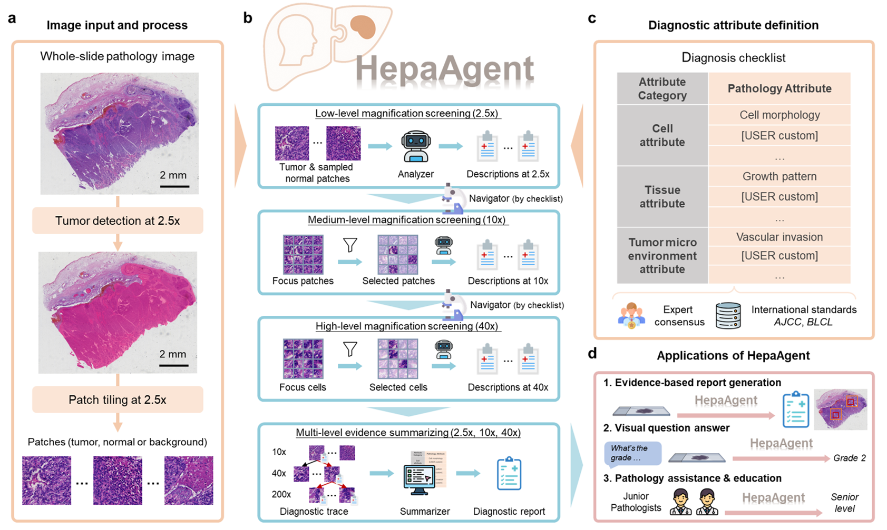

# HepaAgent: An Explainable and Standardized Agentic System for HCC Pathology Analysis

Official implementation of **HepaAgent**, an explainable agentic framework designed for the diagnostic interpretation of hepatocellular carcinoma (HCC) whole-slide images (WSIs). 

HepaAgent reframes whole-slide interpretation as an autonomous multiscale reasoning workflow, bridging the gap between visual perception and clinical logic.

---

## 🖼️ System Overview


*Figure 1: Overview of the HepaAgent framework, illustrating the hierarchical reasoning process and the agentic workflow for HCC diagnostic interpretation.*

---

## 🌟 Key Features

* **Explainable Agentic Workflow**: Unlike "black-box" models, HepaAgent replicates the hierarchical reasoning of human experts by linking low-magnification architectural patterns with high-resolution cellular morphology.
* **Knowledge-Grounded Reasoning**: Anchored in authoritative clinical taxonomies (e.g., WHO Classification, AJCC Staging), the system uses a structured checklist of 45 diagnostic tasks to ensure standardized analysis.
* **Human-in-the-Loop (HITL)**: Supports interactive collaboration where pathologists can manually designate Regions of Interest (RoIs) and configure dynamic diagnostic attributes.
* **Training-Free Generalization**: An architecture requiring no parameter updates that exhibits robust performance on rare and complex variants, such as combined hepatocellular-cholangiocarcinoma (cHCC-CCA).
* **Hallucination Suppression**: By grounding assertions in specific visual "Diagnostic Traces," HepaAgent significantly reduces the generative hallucinations common in standard MLLMs.

## 🛠 System Workflow

The HepaAgent analysis follows a four-phase interactive process:

1.  **Slide Input & Checklist Edition**: Users load WSIs and configure specific analysis prompts or diagnostic checklists to match the clinical context.
2.  **Automatic Tracking & Analysis**: The system scans the slide to detect lesions and identifies RoIs across multiple scales (2.5×, 10×, 40×) using an uncertainty-driven navigation module.
3.  **Manual RoI Selection (Optional)**: Clinicians can refine or add new regions to ensure the analysis focuses on the most pathologically relevant tissues.
4.  **Final Report Generation**: The system executes a fine-grained analysis of cell morphology and nuclear characteristics to generate a structured diagnostic report.

## 📊 Benchmarks

HepaAgent has been rigorously evaluated on multiple datasets:
* **HepaAgent Benchmark**: 1,210 WSIs with 3,158 MCQs and 542 reasoning tasks.
* **TCGA-LIHC**: Publicly available cohort for external validation.
* **cHCC-CCA Benchmark**: Specialized evaluation for rare histological variants.

HepaAgent consistently outperforms leading models (including GPT-4V, Qwen-VL-Plus, and SlideChat) across all diagnostic categories.

---

## 📂 Repository Status & Open Source Plan

> [!IMPORTANT]
> **Open Source Notice**: The full source code, model weights, and datasets for HepaAgent will be officially released to the public upon the formal acceptance of our research paper. 
> 
> **For Reviewers**: The complete implementation code is currently provided as **`code.zip`** within the **Supplementary Materials** of our submission.

## 🙏 Acknowledgements

We would like to express our sincere gratitude to the developers and communities of the following foundational models and frameworks, which were instrumental in the development of HepaAgent:
* **TRIDENT**: For its advanced architectural support.
* **UNI**: For providing robust vision foundational capabilities.
* **MUSK**: For its contributions to multi-scale feature representation.

## ✉️ Contact

For any inquiries or discussions regarding the project, please contact:
* **Linghan Cai**: cailh@stu.hit.edu.cn

## 📑 Citation

If you find this work helpful in your research, please cite our paper:

```bibtex
@article{cai2026hepaagent,
  title={HepaAgent: An explainable and standardized whole-slide pathology image analysis agentic system for hepatocellular carcinoma},
  author={Cai, Linghan and others},
  journal={Preprint},
  year={2026}
}
